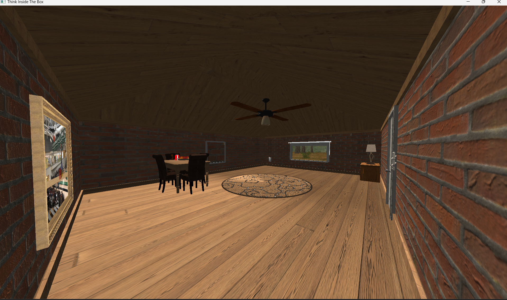

# RoomWalkthroughSim - 3D Room
RoomWalkthroughSim is a 3D simulation program that allows users to explore, visualize, and interact with a virtual room environment. Users can navigate through the room, adjust the layout, and interact with various objects in the space. This program was built using modern graphics programming techniques and tools.

## Prerequisites
The following setup instructions are for Windows.

Before running the program, ensure you have the following installed:

### 1. CLion IDE (for C++ development)
   - [Download CLion](https://www.jetbrains.com/clion/)
### 2. C++ Compiler
For Windows users, you can use WSL, MinGW, or Visual Studio. These instructions will pertain to Visual Studio.
- [Download Visual Studio 2022](https://visualstudio.microsoft.com/vs/)
- During installation, select the "Desktop development with C++" workload.

## Installation
### Clone the Repository
Clone this repository to your local machine using the following command:

```bash
git clone https://github.com/jrohrbaugh0812/room-walkthrough-sim.git```
```

### Set Up Development Environment
1. Open CLion and select Open from the main screen (you may need to close any open projects).
2. Navigate to the repository folder to open the project.
3. In the popup dialog, select Manage toolchains.
4. In the Toolchain dialog, select Visual Studio, and in the Architecture dropdown, choose amd64.
5. Click OK to apply the changes. This will configure Visual Studio x64 as the compiler for this project.

## Usage
### Running the Program
Once the program is running, a 3D walkthrough environment will appear. Use keyboard and mouse inputs to navigate the room and interact with objects.

### Controls
- WASD: Move forward, backward, left, and right.

### Image of Room


### Image of Outside


## Acknowledgements
This was my [final project](https://ycpcs.github.io/cs370-fall2024/assign/project.html) for CS370 (Computer Graphics I) at YCP, taught by Dr. Babcock. Thank you to Dr. Babcock for the foundational resources and guidance, which helped shape this project.